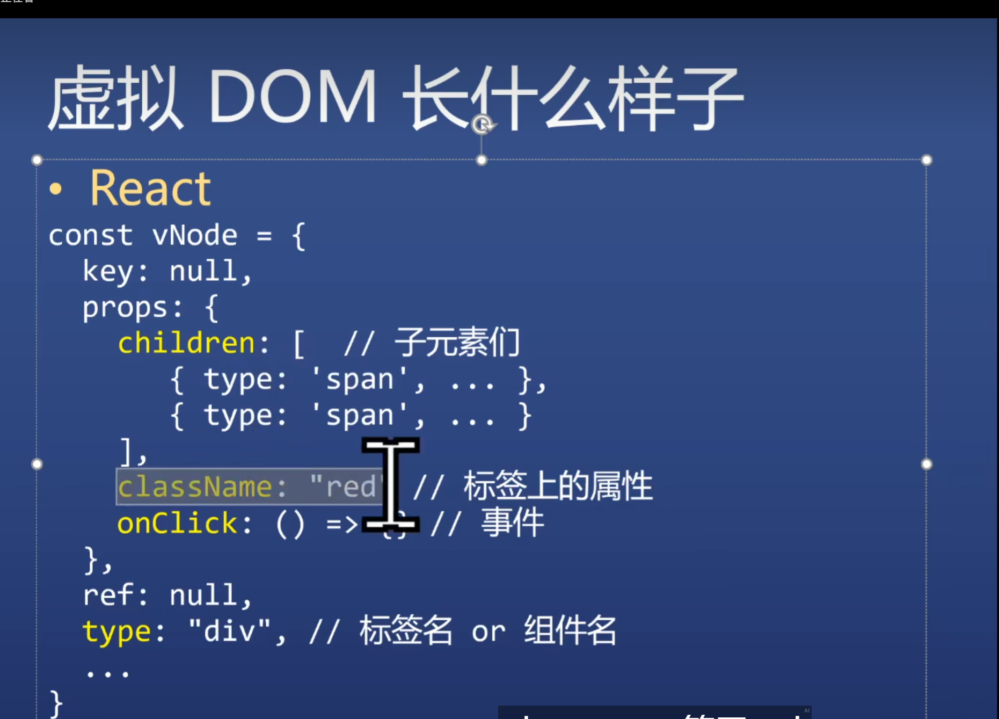

## 虚拟dom优点

- 减少DOM操作，可以多次操作合并为一次操作
- diff算法可以把多余的操作省略掉
- 跨平台，虚拟dom不仅可以变成dom，还可以变成小程序，安卓应用，ios应用，虚拟dom本质上只是一个js对象

从虚拟 DOM 到 Fiber 的主要步骤有以下几个方面：

1. 虚拟 DOM 构建：React 通过 JSX 编译生成虚拟 DOM 树，这是一棵轻量级的 JavaScript 对象树，描述了组件的 UI 结构。
2. 协调（Reconciliation）：在这个阶段，React 会将新构建的虚拟 DOM 树与前一次渲染的虚拟 DOM 树进行比较。React 使用 diff 算法来找出两个树之间的差异，从而确定哪些部分需要更新。这个过程主要是为了最大限度地减少不必要的 DOM 操作。
3. 生成 Fiber 树：根据协调阶段确定的需要更新的部分，React 会生成一棵 Fiber 树。Fiber 是 React 用来表示组件的状态和结构的单元，每个 Fiber 节点都包含了组件的类型、状态、子节点和兄弟节点等信息。这棵树不仅仅是一个 UI 描述，还包含了与渲染相关的调度信息，便于 React 更精细地管理更新过程。
4. 构建工作单元：React 将确定的更新操作分解成多个称为工作单元的任务，这些任务被组织成 effect list（副作用列表）。每个工作单元都与一个 Fiber 节点关联，包括组件的添加、更新、删除操作，以及可能的副作用（如生命周期方法的调用）。
5. 执行工作单元：React 使用调度器来管理这些工作单元的执行顺序。调度器会根据任务的优先级决定执行顺序，以确保高优先级任务（如用户交互）优先执行。React 会依次执行这些工作单元，更新组件状态，执行必要的副作用。
6. 更新 Fiber 树：在执行工作单元时，React 会根据任务的结果更新 Fiber 树。这可能包括改变 Fiber 节点的状态、创建新的 Fiber 节点、或者标记某些节点为不需要渲染。在所有工作单元执行完毕后，Fiber 树的最新状态将被用于最终的 DOM 更新。

diff 算法作用在 reconcile 阶段，也就是构建 JSX 编译转换之后，FIber 树建立之前。
