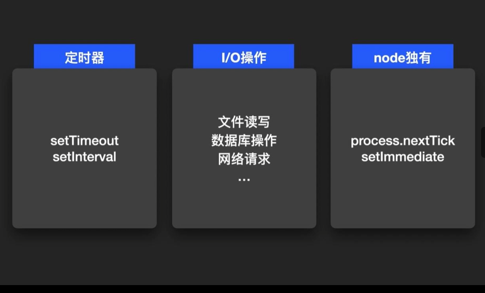
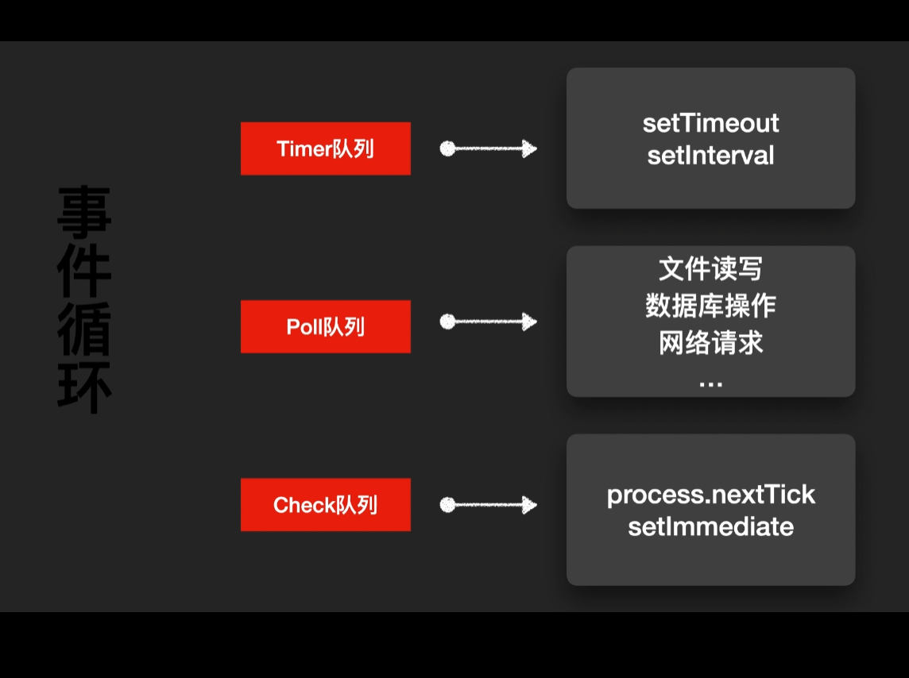
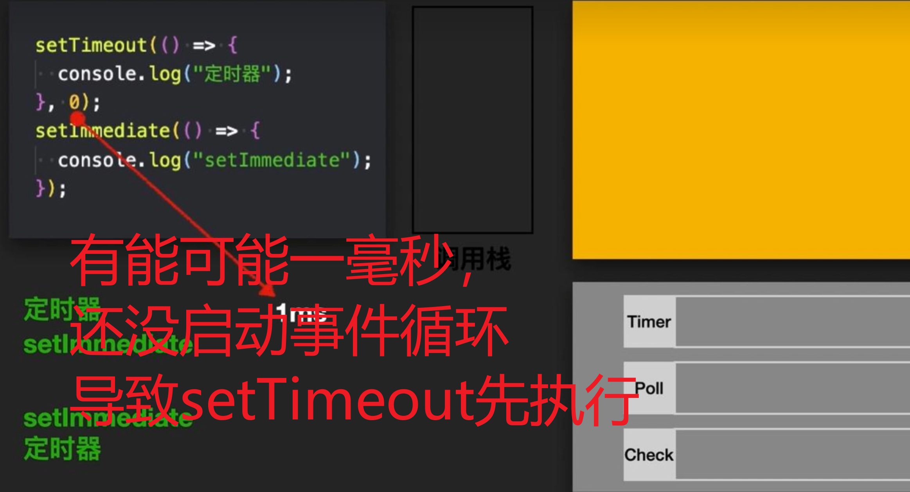
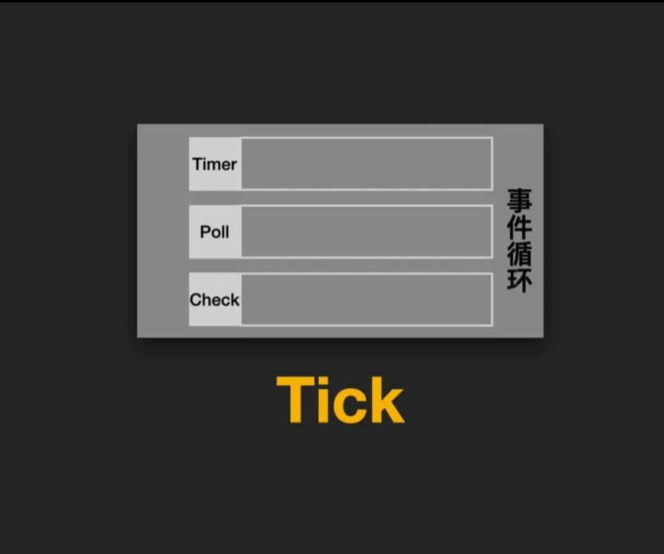
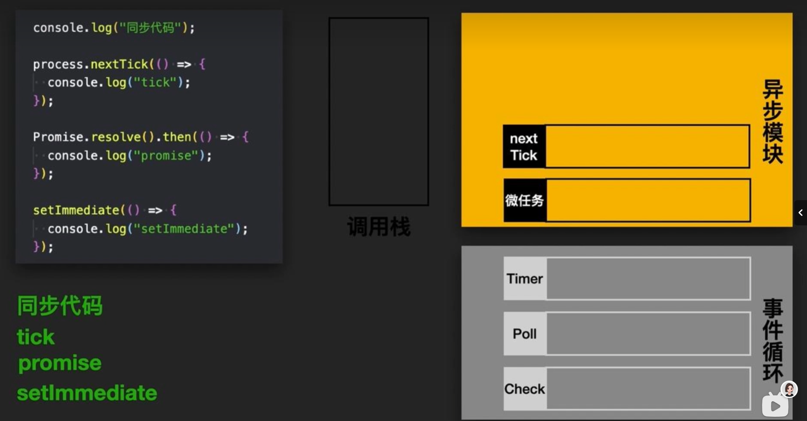

## 进程和线程

#### 进程

进程是操作系统的一个基本概念，它表示**正在运行**的一个**程序的实例**。每个进程都有自己独立的地址空间，包括代码、数据、堆栈等，同时还包括了进程所需的一些系统资源，比如文件描述符、信号处理设置。**进程之间一般是独立的**，彼此不会影响。

---

#### 线程

线程是**进程**中的**一个实体**，是CPU调度和分派的基本单位。一个进程可以包好多个线程， 这些线程共享进程的地址空间和系统资源，但每个线程有自己的调用栈和局部变量。**多线程**使得程序可以进行**并发执行**，提高了程序的效率和响应速度。

## 异步和同步

#### 同步

同步操作是指程序按序执行，每个操作都要等待上个操作完成才能进行。

#### 异步

异步操作是程序中的操作可以同时进行，不需要等待上一个操作完成才能进行下一个操作。异步操作通常会用**回调函数**，**Promise**或者**async/await**等机制来处理。这种执行方式可以提高程序的效率和响应速度，特别适合大量的I/O操作或网络请求。

## 宏任务和微任务

在异步中，有包括宏任务和微任务。

宏任务：script，定时器，setImmediate，I/O，ui渲染

微任务： Promise.then(),MutationObserver

## Event-Loop执行顺序

1. 先执行同步代码(script)这是宏任务
2. 当执行栈为空时，查询**任务队列**是否有异步任务需要执行
3. 如有则执行微任务
4. 如果有需要则会渲染页面
5. 执行下一个宏任务
6. 重复上面操作

## node事件循环

上面图片可以放入IO操作回调进行可控

Poll队列会**判断等待**

**SetImediate**会**直接**进入Check队列

nextTick是插入每次事件循环前面

#### 结合微任务

#### 刷题：

[【建议星星】要就来45道Promise面试题一次爽到底(1.1w字用心整理)你盼世界，我盼望你无bug。Hello 大家 - 掘金](https://juejin.cn/post/6844904077537574919)
