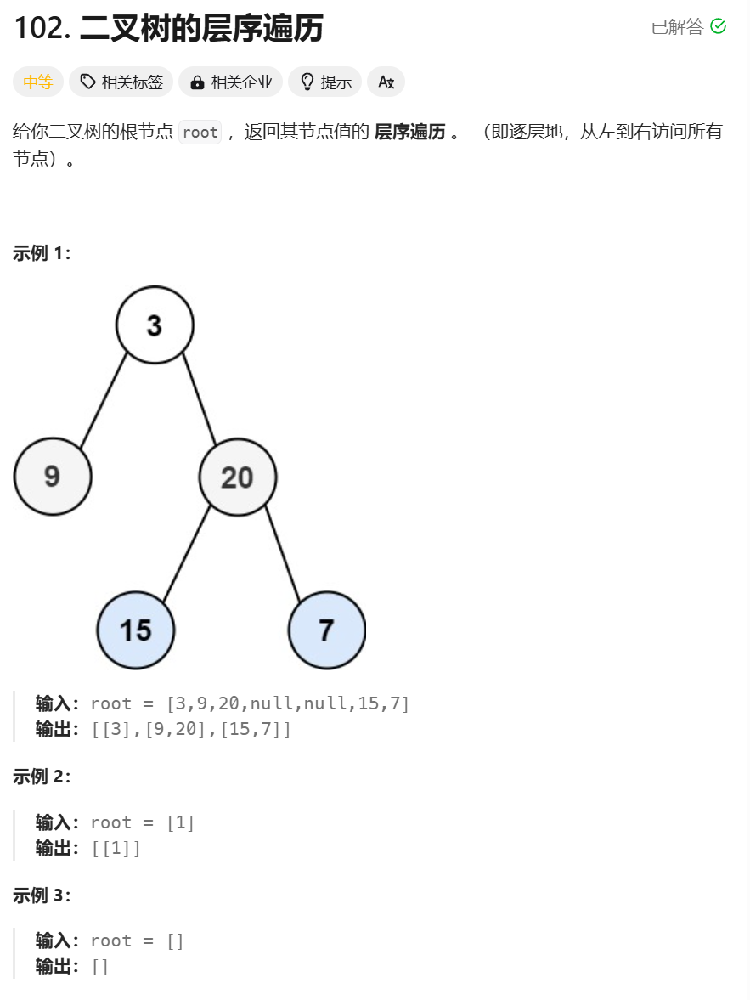

```javascript
/**
 * Definition for a binary tree node.
 * function TreeNode(val, left, right) {
 *     this.val = (val===undefined ? 0 : val)
 *     this.left = (left===undefined ? null : left)
 *     this.right = (right===undefined ? null : right)
 * }
 */
/**
 * @param {TreeNode} root
 * @return {number[][]}
 */
var levelOrder = function (root) {
  if (root === null) return [];
  let ans = [];
  let cur = [root];
  while (cur.length) {
    let nxt = [];
    let vals = [];
    for (const node of cur) {
      vals.push(node.val);
      if (node.left) nxt.push(node.left);
      if (node.right) nxt.push(node.right);
    }
    cur = nxt;
    ans.push(vals);
  }
  return ans;
};
```
