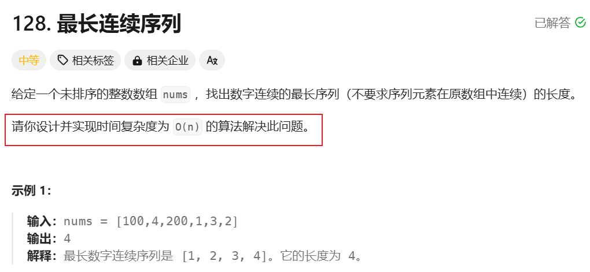

逻辑：只有hasmap；做到一遍循环达到o(n)

if(!set.has(x-1))是为了找到目前最小数，也就是剩余的开始

while(set.has(cur+1))开始统计

```javascript
/**
 * @param {number[]} nums
 * @return {number}
 */
var longestConsecutive = function (nums) {
  const set = new Set(nums)
  let ans = 0
  for (let x of set) {
    if (!set.has(x - 1)) {
      let cur = x
      let count = 1
      while (set.has(cur + 1)) {
        cur++
        count++
      }
      ans = Math.max(ans, count)
    }
  }
  return ans
}
```
