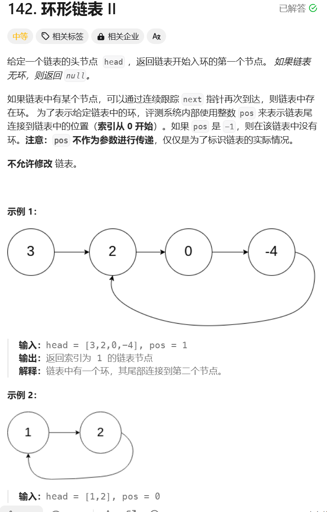

```javascript
/**
 * Definition for singly-linked list.
 * function ListNode(val) {
 *     this.val = val;
 *     this.next = null;
 * }
 */

/**
 * @param {ListNode} head
 * @return {ListNode}
 */
var detectCycle = function(head) {
    let fast = head, slow = head;
    while(fast && fast.next) {
        fast = fast.next.next
        slow = slow.next
        if (fast === slow) {
            while(slow !== head) {
                slow = slow.next
                head = head.next
            }
            return slow
        }
    }
    return null
};
```

