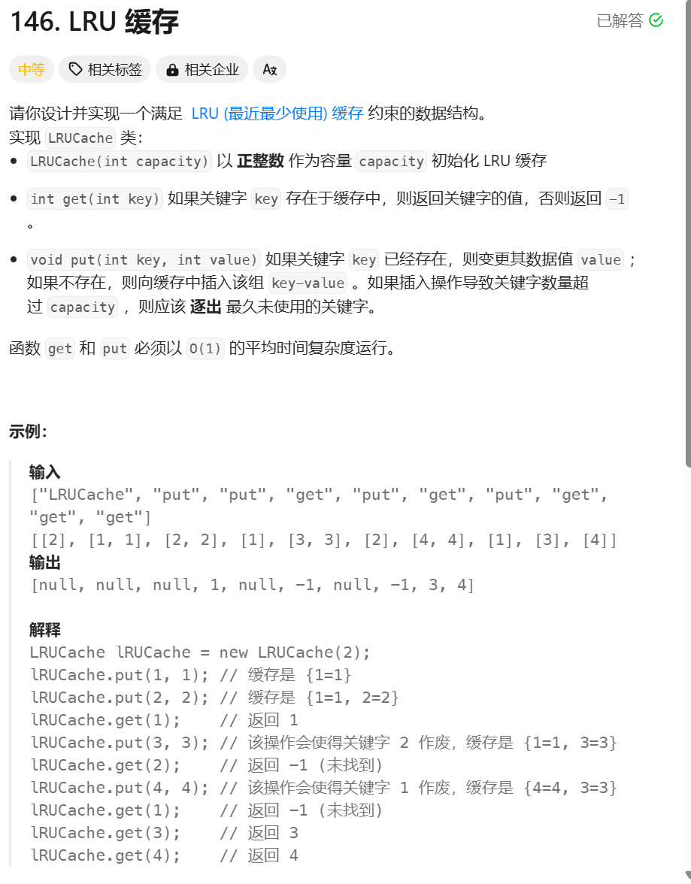

```javascript
/**
 * @param {number} capacity
 */
var LRUCache = function(capacity) {
    this.limit = capacity;
    this.cache = new Map();
};

/**
 * @param {number} key
 * @return {number}
 */
LRUCache.prototype.get = function(key) {
    let tmp;
    if(this.cache.has(key)){
        tmp = this.cache.get(key);
        this.cache.delete(key);
        this.cache.set(key,tmp);
    }
    return tmp ?? -1;
};

/**
 * @param {number} key
 * @param {number} value
 * @return {void}
 */
LRUCache.prototype.put = function(key, value) {
    if(this.cache.has(key)){
        this.cache.delete(key)
    }
    this.cache.set(key,value);
    if(this.cache.size > this.limit){
        this.cache.delete(this.cache.keys().next().value)
    }
};

/**
 * Your LRUCache object will be instantiated and called as such:
 * var obj = new LRUCache(capacity)
 * var param_1 = obj.get(key)
 * obj.put(key,value)
 */
```
