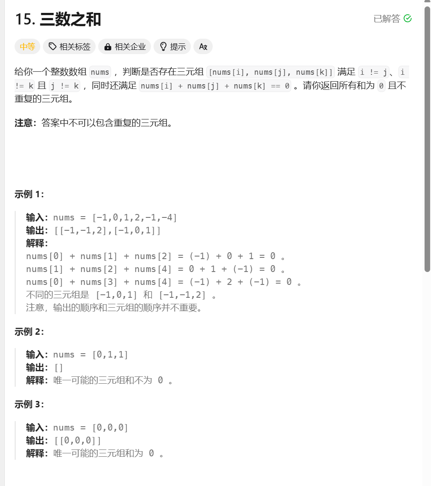

```javascript
/**
 * @param {number[]} nums
 * @return {number[][]}
 */
var threeSum = function (nums) {
    nums.sort((a, b) => a - b);
    const n = nums.length;
    const ans = [];
    for (let i = 0; i < n - 2; i++) {
        if (i > 0 && nums[i] === nums[i - 1]) continue;
        if (nums[i] + nums[i + 1] + nums[i + 2] > 0) break;
        if (nums[i] + nums[n - 1] + nums[n - 2] < 0) continue;
        let j = i + 1, k = n - 1;
        while (j < k) {
            const s = nums[i] + nums[k] + nums[j];
            if (s < 0) {
                j++;
            } else if (s > 0) {
                k--;
            } else {
                ans.push([nums[i], nums[j], nums[k]])
                for (j++; j < k && nums[j] === nums[j - 1]; j++);
                for (k--; j < k && nums[k] === nums[k + 1]; k--);
            }
        }
    }
    return ans;
};
```

