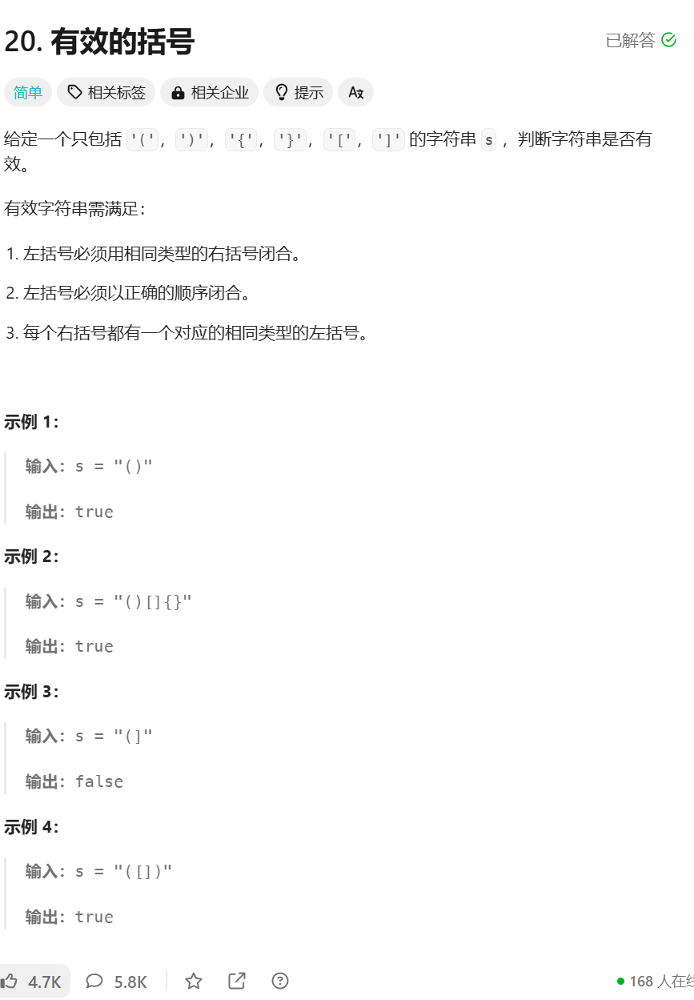

```javascript
/**
 * @param {string} s
 * @return {boolean}
 */
var isValid = function (s) {
    if (s.length % 2 !== 0) return false;
    let map = { '[': ']', '{': '}', '(': ')' };
    let st = [];
    for (let c of s) {
        if (map[c]) {
            st.push(map[c]);
        } else if (st.length === 0 || st.pop() !== c) return false
    }
    return st.length === 0
};
```

