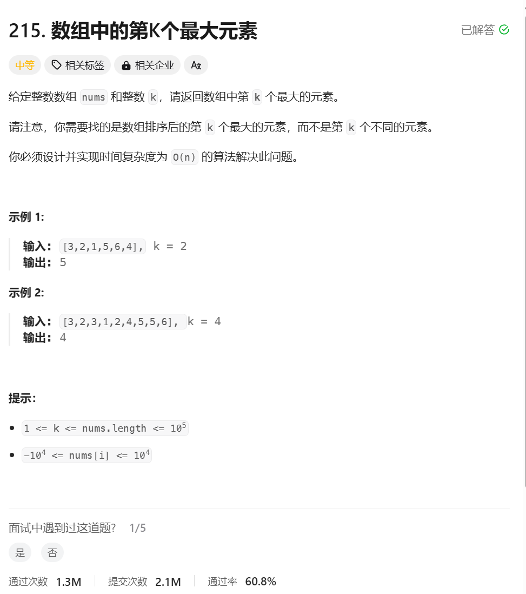

## 第k大是nums.length - k

## 右边是闭区间


```javascript
/**
 * @param {number[]} nums
 * @param {number} k
 * @return {number}
 */
var findKthLargest = function(nums, k) {
    let ans = quickSelect(nums,0,nums.length-1,nums.length - k);
    return ans;
};

function quickSelect(nums,l,r,k) {
    if(l === r) return nums[k];
    let i = l -1,j = r + 1;
    const x = nums[l];
    while(i<j){
        do i++; while(nums[i]<x);
        do j--;while(nums[j]>x);
        if(i<j){
            [nums[i],nums[j]] = [nums[j],nums[i]];
        }
    }
    if(k<=j){
        return quickSelect(nums,l,j,k)
    } else {
        return quickSelect(nums,j+1,r,k)
    }
    
}
```

