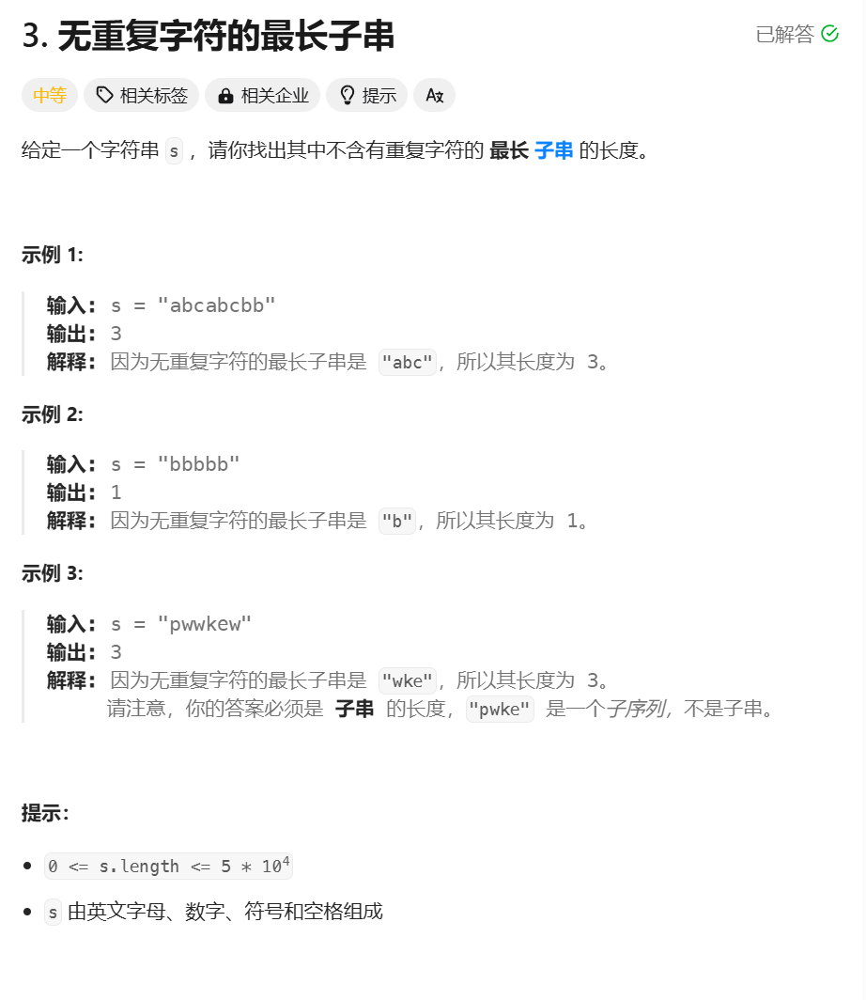

```javascript
const lengthOfLongestSubstring = function (s) {
  let l = 0,
    ans = 0
  let set = new Set()
  for (let r = 0; r < s.length; r++) {
    let c = s[r]
    while (set.has(c)) {
      set.delete(s[l])
      l++
    }
    set.add(c)
    l
    ans = Math.max(anx, r - l + 1)
  }
  return ans
}
```
