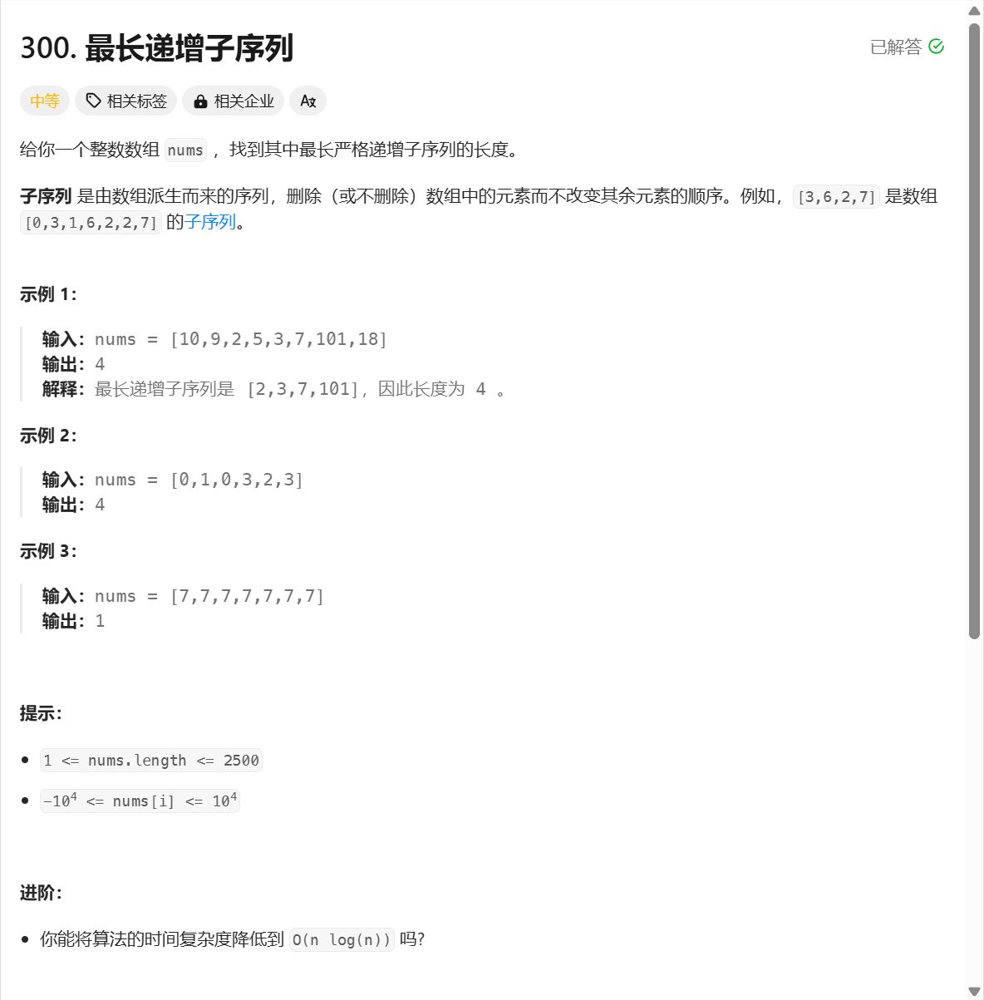

```javascript
/**
 * @param {number[]} nums
 * @return {number}
 */
var lengthOfLIS = function(nums) {
    let dp = Array(nums.length).fill(1);
    let ans = 1;
    for (let i = 1;i<nums.length;i++){
        for(let j = 0;j<i;j++){
            if (nums[i]>nums[j]){
                dp[i] = Math.max(dp[i],dp[j]+1)
            }
        }
        ans = Math.max(ans,dp[i])
    }
    return ans
};
```

