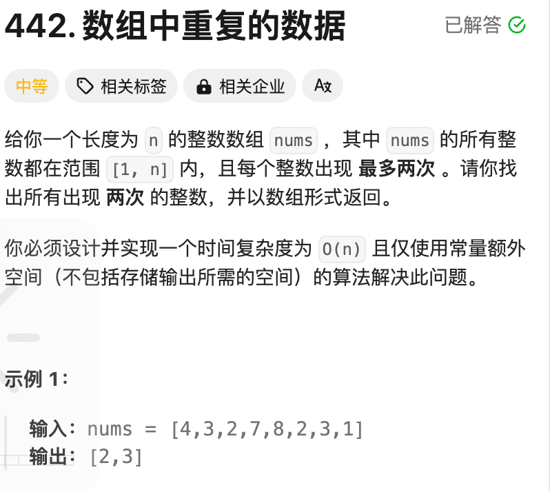

```javascript
const findDuplicates = function (nums) {
  const map = new Map();
  const ans = [];
  for (let x of nums) {
    if (map.has(x)) {
      ans.push(x);
    }
    map.set(x, true);
  }
  return ans;
};
```
