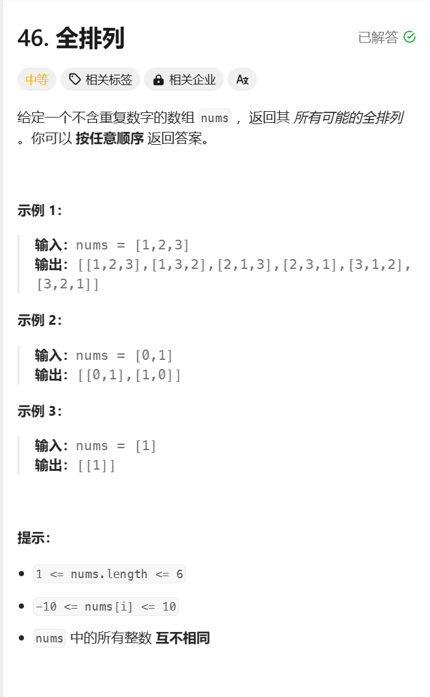

```javascript
/**
 * @param {number[]} nums
 * @return {number[][]}
 */
var permute = function(nums) {
    let ans = [];
    dfs([]);
    return ans;
    function dfs(path){
        if(path.length === nums.length) {
            ans.push(path)
            return
        }
        for(let s of nums){
            if(path.includes(s)) continue;
            dfs(path.concat(s))
        }
    }
};
```

