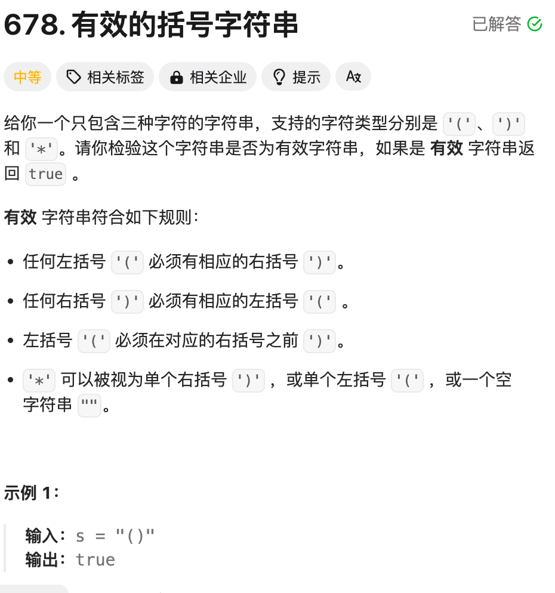

```
/**
 * @param {string} s
 * @return {boolean}
 */
const checkValidString = function(s) {
    let minCount = 0, maxCount = 0;
    for(let c of s) {
        if(c === "(") {
            maxCount ++;
            minCount ++;
        } else if (c === ")") {
            maxCount--;
            minCount = Math.max(minCount -1,0);
            if (maxCount <0) return false;
        } else {
            minCount = Math.max(minCount-1,0);
            maxCount ++;
        }
    }
    return minCount === 0;
};
```
