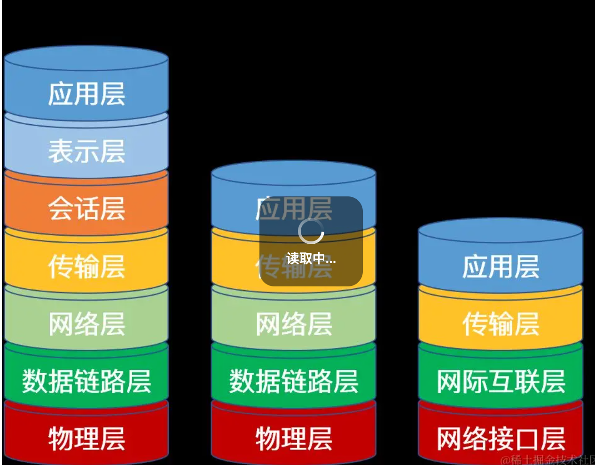

### 1. 物理层（Physical Layer）

- **功能**：该层是整个网络通信的基础，负责处理物理介质上的信号传输，包括定义传输介质（如电缆、光纤、无线等）的物理特性、信号的编码与解码、数据传输的速率、接口的机械和电气特性等。
- **设备**：常见的物理层设备有集线器、中继器等。例如，集线器只是简单地将接收到的信号进行放大和转发，不具备任何智能处理能力。
- **示例**：当你通过网线连接计算机和路由器时，物理层负责将计算机产生的数字信号转换为适合在网线上传输的电信号，并通过网线传输到路由器，反之亦然。

### 2. 数据链路层（Data Link Layer）

- **功能**：主要负责将物理层接收到的信号组织成数据帧，并进行差错检测和纠正，同时提供介质访问控制（MAC），确保数据在物理链路上的可靠传输。该层还处理 MAC 地址，用于标识网络中的不同设备。
- **设备**：典型的数据链路层设备是交换机，它根据 MAC 地址转发数据帧，能够识别不同设备的 MAC 地址，并将数据准确地发送到目标设备。
- **示例**：在局域网中，当一台计算机要向另一台计算机发送数据时，数据链路层会为数据添加源 MAC 地址和目标 MAC 地址，形成数据帧，然后通过交换机进行转发。

### 3. 网络层（Network Layer）

- **功能**：负责将数据从源端传输到目标端，主要处理网络中的路由选择和寻址问题。该层使用 IP 地址来标识网络中的不同设备，并根据网络拓扑结构选择最佳的传输路径。
- **设备**：路由器是网络层的核心设备，它根据 IP 地址进行数据包的转发，能够连接不同的网络，并在不同网络之间进行数据传输。
- **示例**：当你访问互联网上的某个网站时，网络层会根据网站的 IP 地址，通过路由器选择合适的路径将数据包发送到目标服务器。

### 4. 传输层（Transport Layer）

- **功能**：提供端到端的可靠通信，确保数据在源端和目标端之间的准确传输。该层主要有两种协议：TCP（传输控制协议）和 UDP（用户数据报协议）。TCP 提供可靠的、面向连接的传输，UDP 则提供不可靠的、无连接的传输。
- **端口号**：传输层使用端口号来区分不同的应用程序，每个应用程序都有一个唯一的端口号，通过端口号可以将数据准确地分发到相应的应用程序。
- **示例**：当你使用浏览器访问网页时，浏览器会使用 TCP 协议与服务器建立连接，通过端口号 80（HTTP）或 443（HTTPS）进行数据传输，确保网页内容能够完整、准确地传输到你的浏览器。

### 5. 会话层（Session Layer）

- **功能**：负责建立、管理和终止不同应用程序之间的会话。会话是指两个应用程序之间的逻辑连接，会话层提供了会话的建立、拆除和同步等功能，确保数据在会话期间的有序传输。
- **会话管理**：会话层可以处理会话的建立（如通过身份验证等方式）、会话的维持（如定期发送心跳包）和会话的结束（如正常关闭或异常中断）等操作。
- **示例**：在远程登录系统时，会话层会负责建立用户与服务器之间的会话，在会话期间，确保用户输入的命令和服务器返回的结果能够正确传输，当用户退出登录时，会话层会终止该会话。

### 6. 表示层（Presentation Layer）

- **功能**：主要负责数据的表示和转换，确保不同系统之间能够正确理解和处理数据。该层处理数据的加密、解密、压缩、解压缩以及数据格式的转换等操作。
- **数据格式转换**：例如，将不同计算机系统中使用的字符编码（如 ASCII、UTF - 8 等）进行转换，或者将图像、音频等数据的格式进行转换，以适应不同的应用程序和设备。
- **示例**：当你在浏览器中访问一个加密的网站时，表示层会对服务器发送过来的加密数据进行解密，将其转换为可识别的明文数据；同时，在将用户输入的数据发送到服务器时，可能会对数据进行加密处理。

### 7. 应用层（Application Layer）

- **功能**：是用户与网络之间的接口，直接为用户的应用程序提供服务。该层包含了各种应用协议，如 HTTP（超文本传输协议）、FTP（文件传输协议）、SMTP（简单邮件传输协议）等，这些协议定义了应用程序之间进行通信的规则和格式。
- **应用程序交互**：应用层允许用户通过各种应用程序（如浏览器、邮件客户端、文件传输工具等）与网络进行交互，实现各种具体的业务功能。
- **示例**：当你使用浏览器访问网页时，浏览器就是一个应用层的客户端程序，它使用 HTTP 协议与服务器进行通信，获取网页的内容并显示给用户；当你使用邮件客户端发送和接收邮件时，邮件客户端会使用 SMTP 和 POP3/IMAP 等协议与邮件服务器进行交互。