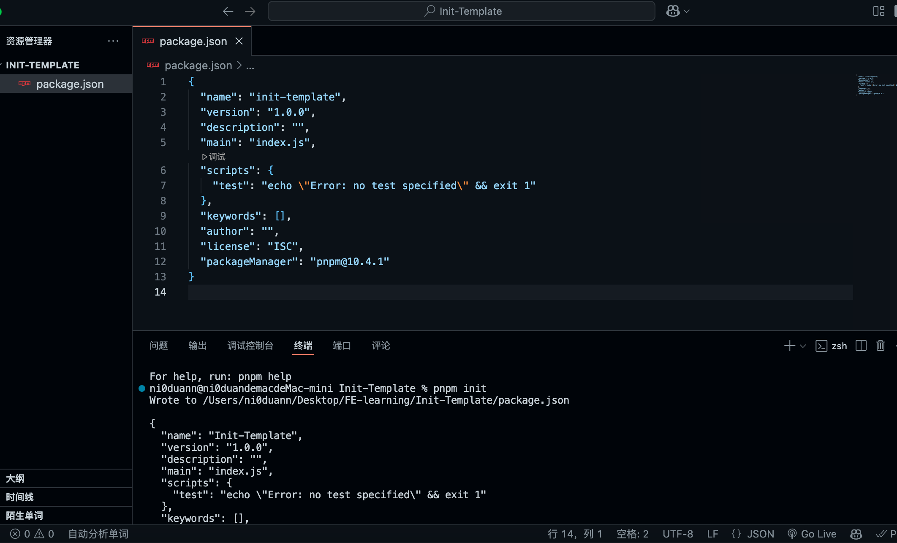
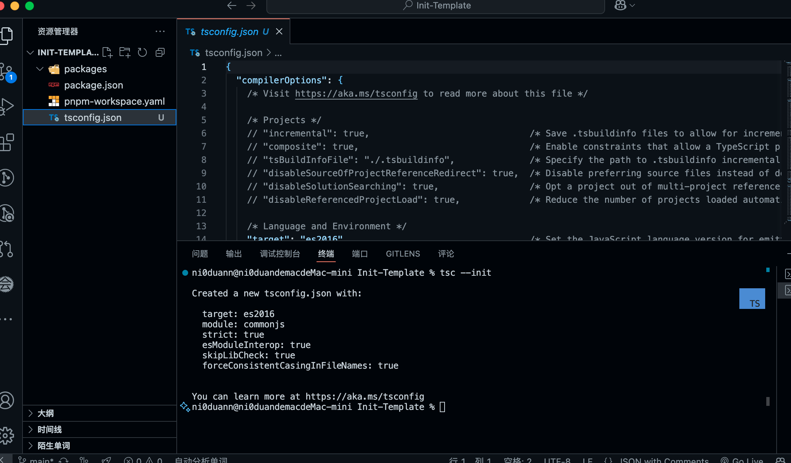
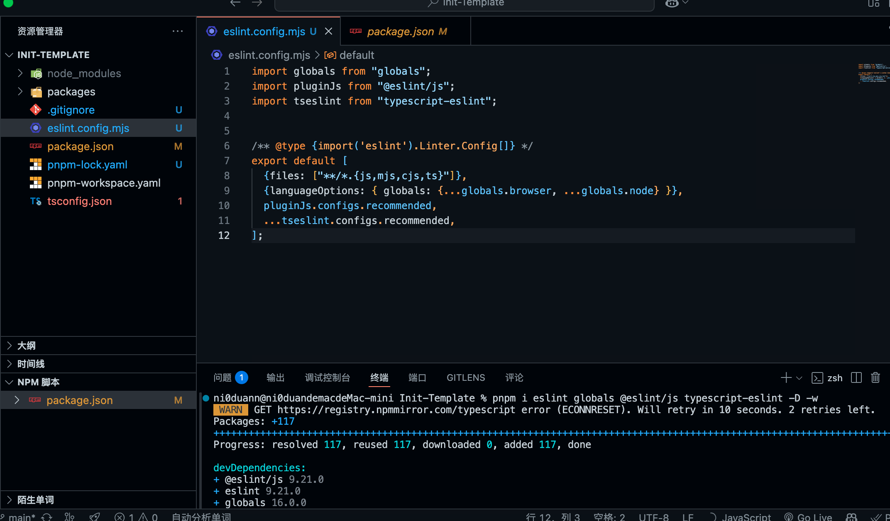

## 前言

最近做的项目开始脱离了脚手架，第一次从0构建自己的项目

由于有点强迫症，自己构建的东西，想要做个“最舒服的”，

故沉淀下自己的构建新项目最佳实践

也看了好几遍文章，我个人认为一个好的项目应该具备以下几点也是最基本的（个人摸索的见解）：

1. eslint               代码错误和规范检查
2. prettier           代码自动格式化
3. pnpm              包管理工具（主要是解决幽灵依赖问题）
4. husky              超快现代原生git勾子
5. commitlint     git commit提交规范化
6. typescript       类型检查
7. monorepo     仓库管理架构（一般业务代码不需要）
8. Rspack            字节推出的新一代构建工具（rust构建的速度超快）


## 实践

#### 1.pnpm管理

全局安装pnpm

```
npm i pnpm -g
```

初始化packaage.json

```
pnpm init
```



#### 2.monorepo

项目根目录新建pnpm-workspace.yaml文件

添加包依赖路径

```
packages:
  - "packages/*"
```

添加packages文件夹


## 3.typescript

全局安装typescript

```
pnpm i typescript -g
```

typescript 初始化

```
tsc --init
```



#### 4.Eslint代码检查

安装eslint 

```
pnpm create @eslint/config@latest
```

然后选择自己项目需要的选项

依赖安装必须 -w

```
pnpm i eslint globals @eslint/js typescript-eslint -D -w
```



下面是rule的配置选择自己喜欢的

https://eslint.org/docs/latest/rules


#### 4.Prettier代码自动格式化

